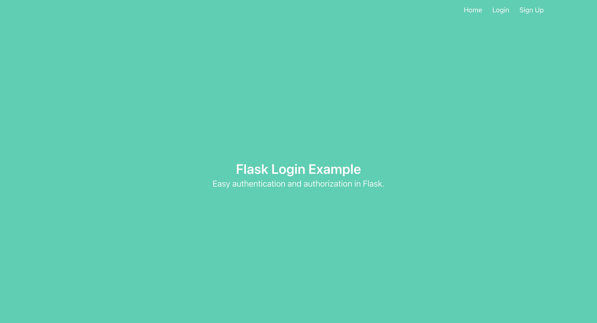

# COMP3310 Week 10

This workshop uses similar code to the Week8 workshop, but now you will be integrating tests into the framework.

## Installation Instructions

For this task you will need to have the following installed:

- python3 (version 3.10 or below)
- pip

If you have a Windows 10 machine, you can follow instructions on installing Python here: https://www.digitalocean.com/community/tutorials/install-python-windows-10 

Pip is the package manager for Python.  You can install the remaining packages required for this task using pip. You will need to run the following:
To start you should create and activate a virtual environment:

 $ python -m venv env        # use `virtualenv env` for Python2, use `python3 ...` for Python3 on Linux & macOS   
 $ source env/bin/activate   # use `env\Scripts\activate` on Windows   
 $ pip install -r requirements.txt   

This web application has been tested on Python 3.10.13. If you have problems running this app, it is recommended that you downgrade to Python 3.10.13. Instructions on how to do this (on Mac with M1 chip) are here: https://stackoverflow.com/questions/62898911/how-to-downgrade-python-version-from-3-8-to-3-7-mac (replacing 3.7 with 3.10.13).

You will also need sqlite installed for the database backend.

### Initialising the database

You should first initialise the database as follows:
- python initialise_db.py

This should create an sqlite database under the instance directory. You can view the contents of the database using the sqlite command line interface as follows:

sqlite3 instance/db.sqlite
> .schema  
CREATE TABLE user (
	id INTEGER NOT NULL, 
	email VARCHAR(100), 
	password VARCHAR(100), 
	name VARCHAR(1000), 
	PRIMARY KEY (id), 
	UNIQUE (email)
);
> select * from user;
>

You should see that there are no users in the database. 

### Run the website

You can run the website by typing:

- python run.py

(If you are using a Mac you may need to type python3 run.py).

You can now browse to the url http://localhost:8001/ and you should see the home page for the website.

